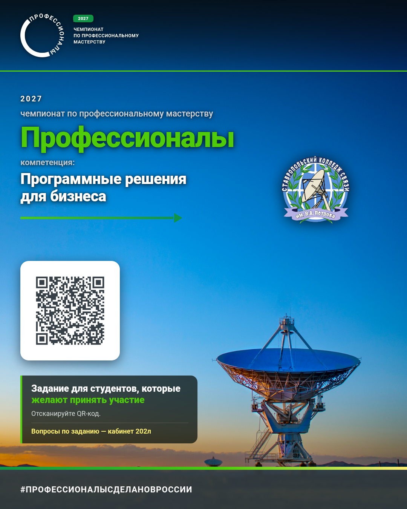

# Задание отбора на чемпионат «Профессионалы»

**Компетенция:** Программные решения для бизнеса
**Чемпионат по профессиональному мастерству «Профессионалы»** · [pro.firpo.ru](https://pro.firpo.ru/)

> Это облегчённое обобщённое задание для отбора. Полное описание — в файле [`ЗАДАНИЕ.md`](ЗАДАНИЕ.md).

## Постер

<p align="center">
  
</p>

Исходник — [`post/poster.html`](post/poster.html), перегенерация — в
[`post/README.md`](post/README.md).

### Текст поста для Max

Картинка выше плюс текст ниже — готовый пост в мессенджер Max. Текст
лежит и отдельным файлом: [`post/max_post.txt`](post/max_post.txt).

```text
🏆 Открыт набор на чемпионат «Профессионалы» — компетенция «Программные решения для бизнеса».

Ставропольский колледж связи им. В.А. Петрова зовёт студентов попробовать себя в разработке. Нужно собрать приложение-планировщик личных задач: база данных, API и клиенты к нему.

Что нужно сделать:
• база данных PostgreSQL — схема, ограничения, индексы и ER-диаграмма
• backend на .NET 9 — регистрация по JWT, задачи, фильтры и сводка
• веб-клиент на React, адаптивный
• desktop-клиент — нативное приложение на Avalonia, без web-обёртки
• мобильный клиент на React Native

📲 Отсканируйте QR на картинке — там репозиторий с полным условием, критериями оценки и пошаговыми инструкциями.

📍 Вопросы по заданию — кабинет 202л.

#ПРОФЕССИОНАЛЫСДЕЛАНОВРОССИИ
```

> Ссылки в тексте нет: адрес репозитория уже внутри QR-кода на картинке.

## 👉 Начинать отсюда

**[Пошаговая инструкция — в wiki репозитория](https://github.com/artemovsergey/professionals-task/wiki)**

Задание разбито на сессии по **2 часа 30 минут**. На каждую сессию — своя
страница wiki с готовым кодом, командами и критериями проверки. Проходите
страницы по порядку: каждая опирается на результат предыдущей.

| # | Сессия | Что делаем |
|---|---|---|
| 0 | Подготовка | Репозиторий, .NET 9, Node 24, PostgreSQL, DBeaver, git.scc |
| 1 | База данных | ER-диаграмма, `schema.sql`, ограничения SQL, индексы, тестовые данные |
| 2 | Backend: каркас | Проект ASP.NET Core, EF Core, миграции, единый формат ответа |
| 3 | Backend: авторизация | Регистрация, вход, хеш пароля, JWT, изоляция данных |
| 4 | Backend: задачи | CRUD, отметка выполнения, сводка, фильтры, поиск, пагинация |
| 5 | Web-клиент: вход | React-проект, регистрация/вход, хранение токена, защита маршрутов |
| 6 | Web-клиент: задачи | Список с фильтрами, форма задачи, сводка, адаптив |
| 7 | Desktop-клиент | Avalonia: вход, список, карточка, сводка |
| 8 | Mobile-клиент | React Native: вход, список, создание/редактирование |
| 9 | Документирование | README, OpenAPI, Postman, тест-кейсы, UML, чек-лист |

---

## СРОКИ

| Событие | Дата |
|---|---|
| Начало отбора | `__.__.2026` |
| Срок сдачи работ | `__.__.2026` |
| Подведение итогов | `__.__.2026` |

## Как участвовать

1. Зарегистрироваться на сайте [pro.firpo.ru](https://pro.firpo.ru/) и подать заявку на компетенцию **«Программные решения для бизнеса»**.
2. Выполнить задание из [`ЗАДАНИЕ.md`](ЗАДАНИЕ.md).
3. Загрузить код в **свой публичный репозиторий на GitHub**.
4. Отправить ссылку на репозиторий организаторам (способ отправки — в сообщении, которое придёт после регистрации).

**Презентация не требуется.** Оценивается код, база данных и документация.

## Что нужно сделать — коротко

Собрать небольшое приложение-**планировщик личных задач** (личные задачи, сроки, приоритеты, категории) из пяти частей:

| Часть | Что это | Обязательно |
|---|---|---|
| 1. **База данных** | PostgreSQL, скрипт создания таблиц | да |
| 2. **Backend + API** | REST API с авторизацией | да |
| 3. **Web-клиент** | Сайт в браузере | да |
| 4. **Desktop-клиент** | Настольное приложение | да |
| 5. **Mobile-клиент** | Приложение на React Native | да |

Все четыре клиента работают с **одним и тем же API** — отдельных бэкендов делать не нужно.

## Стек

Стек **фиксированный** — одинаковый для всех участников отбора.

| Часть | Технология | Версия |
|---|---|---|
| База данных | PostgreSQL | 15+ |
| Backend / API | .NET (ASP.NET Core Web API) + Entity Framework Core | .NET 9 |
| Web-клиент | React + TypeScript + Vite | React 19 |
| Desktop-клиент | C# / Avalonia (нативный UI) | Avalonia 11 |
| Mobile-клиент | React Native (Expo) | React Native 0.81+ |
| Инструменты | DBeaver или DataGrip, Postman, Git | — |

> **Desktop-клиент должен быть настольным приложением.** Оборачивать
> web-страницу в Electron, Tauri или PWA и считать это desktop-разработкой
> нельзя — за этот раздел снимут все баллы. Tauri и PWA допустимы на
> финальном этапе, где web-обёртка разрешена.

> **Основная ОС на площадке — РедОС 8.0.** Отбор можно проходить на Windows,
> но код обязан запускаться на РедОС: никаких Windows-only путей и команд.
> Как поставить PostgreSQL и проверить проект на РедОС — в wiki.

## Готовые материалы в этом репозитории

| Файл | Что внутри |
|---|---|
| [`ЗАДАНИЕ.md`](ЗАДАНИЕ.md) | Полный текст задания |
| [`db/schema.sql`](db/schema.sql) | Пример скрипта создания таблиц — можно взять за основу или написать свой |
| [`db/README.md`](db/README.md) | Требования к базе данных + ER-диаграмма |
| [`api/openapi.yaml`](api/openapi.yaml) | Спецификация API (можно открыть в Swagger UI / редакторе) |
| [`postman/Professionals-Task.postman_collection.json`](postman/Professionals-Task.postman_collection.json) | Коллекция Postman для проверки API |
| [`criteria.md`](criteria.md) | Критерии оценки и баллы |
| [wiki](https://github.com/artemovsergey/professionals-task/wiki) | **Пошаговые инструкции по сессиям — начинать отсюда** |

Всё это — **примеры и подсказки**. Своё решение писать не обязательно, но и не запрещено.

## Как сдавать

В вашем репозитории должны быть:

- исходный код всех пяти частей,
- скрипт создания базы данных,
- `README.md` с инструкцией: как запустить каждый клиент, какие переменные окружения нужны, какие порты используются,
- ER-диаграмма базы данных,
- примеры запросов к API (curl, Postman или Swagger).

---

**Контакты по вопросам задания:** `__.__.___@________.__`

**Организатор:** Ставропольский колледж связи им. В.А. Петрова

---

## Материалы чемпионата

Всё для анонса и подготовки лежит в этом же репозитории:

| Что | Где |
|---|---|
| Постер 1080×1350 | [`post/poster.png`](post/poster.png) |
| Исходник постера (HTML/CSS) | [`post/poster.html`](post/poster.html) |
| Тексты рассылки | [`post/post_full.txt`](post/post_full.txt), [`post/post_short.txt`](post/post_short.txt) |
| Логотипы чемпионата, брендбук | [`assets/`](assets/) |
| Фон постера (снимок антенны) | [`assets/background.jpg`](assets/background.jpg) |
| Задания прошлых этапов 2026 | [`stages/`](stages/) |

Официальные материалы: [pro.firpo.ru](https://pro.firpo.ru/) ·
брендбук и логотипы — в [`assets/Брендбук_2026.pdf`](assets/Брендбук_2026.pdf),
[`assets/Логотипы.pdf`](assets/Логотипы.pdf),
[`assets/Компетенции_ЧВТ.pdf`](assets/Компетенции_ЧВТ.pdf).
