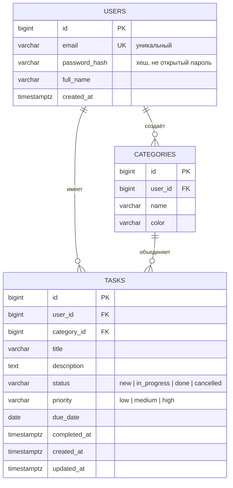

# Требования к базе данных

## Минимальный состав

| Сущность | Обязательна | Поля |
|---|---|---|
| **users** (пользователи) | да | id, email, password_hash, full_name, created_at |
| **tasks** (задачи) | да | id, user_id, title, description, status, priority, due_date, completed_at, created_at, updated_at |
| **categories** (категории) | нет | id, user_id, name, color |

## Что обязательно сделать средствами SQL

- `NOT NULL` на обязательных полях.
- `CHECK` на допустимые значения статуса и приоритета.
- Внешний ключ `tasks.user_id → users.id`.
- Уникальность `users.email`.
- Индексы на `tasks.user_id`, `tasks.status`, `tasks.due_date`.

Ограничения уровня приложения (проверки в коде) не заменяют ограничения в базе — нужны и те, и другие.

## Схема — одним рисунком



## Связь с API

- У каждой задачи есть владелец — `user_id`.
- Все выборки из `tasks` идут с фильтром по текущему пользователю:
  ```sql
  SELECT * FROM tasks WHERE user_id = $1 ORDER BY due_date NULLS LAST;
  ```
- Сводка считается одним запросом с группировкой или условными агрегатами (пример — в конце `schema.sql`).

## Что сдавать

- скрипт создания таблиц (`schema.sql` или миграции);
- ER-диаграмма;
- примеры запросов, которые реально использует ваш backend.
