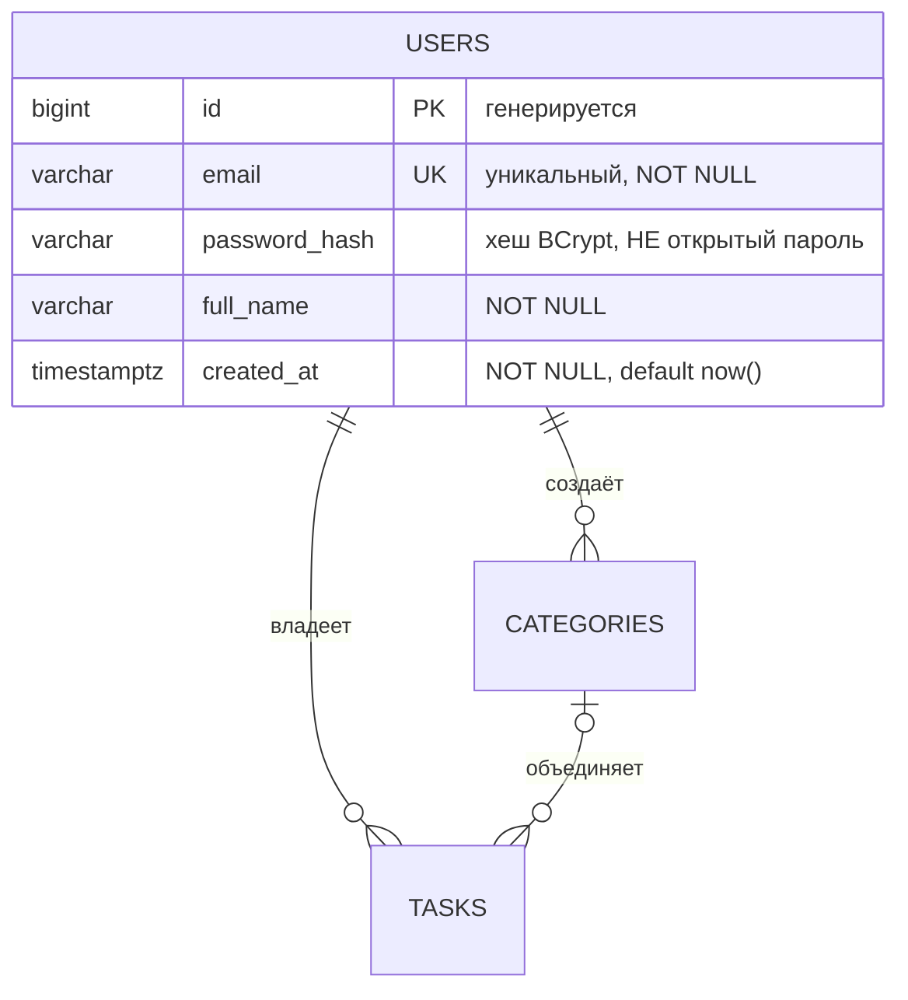

Сессия 1. База данных · 0–20 мин

# Что делаем на этой странице

Разбираем предметную область, фиксируем сущности и ограничения и оформляем
ER-диаграмму. Схема из [03-Скрипт-schema-sql](03-Скрипт-schema-sql) должна
повторять эту модель один в один — эксперт сравнивает их глазами.

# Шаг 1. Читаем требования

Из [`ЗАДАНИЕ.md`](https://github.com/artemovsergey/professionals-task/blob/main/ЗАДАНИЕ.md):

> Обязательны **две** сущности — **пользователь** и **задача**. Третья
> (**категория**) необязательна: за неё баллы не начисляются.

Ключевой вопрос проектирования — **кто владеет задачей**. Ответ: пользователь.
Отсюда `tasks.user_id` и обязательный фильтр по текущему пользователю в каждой
выборке. Изоляция данных потом просто наследуется: в SQL, в API и в клиентах.

# Шаг 2. users

```sql
id            BIGSERIAL     PRIMARY KEY
email         VARCHAR(255)  NOT NULL UNIQUE      -- формат email
password_hash VARCHAR(255)  NOT NULL             -- только хеш
full_name     VARCHAR(255)  NOT NULL
created_at    TIMESTAMPTZ   NOT NULL DEFAULT NOW()
```

Пароль в базе не хранится: только хеш. Поле называется `password_hash`, а не
`password`, — чтобы никто не принял его за открытый пароль.

# Шаг 3. tasks

```sql
id           BIGSERIAL     PRIMARY KEY
user_id      BIGINT        NOT NULL REFERENCES users(id) ON DELETE CASCADE
category_id  BIGINT        NULL     REFERENCES categories(id) ON DELETE SET NULL
title        VARCHAR(200)  NOT NULL              -- не пустой после обрезки пробелов
description  TEXT          NULL
status       VARCHAR(16)   NOT NULL DEFAULT 'new'
priority     VARCHAR(16)   NOT NULL DEFAULT 'medium'
due_date     DATE          NULL
completed_at TIMESTAMPTZ   NULL                  -- только при status = 'done'
created_at   TIMESTAMPTZ   NOT NULL DEFAULT NOW()
updated_at   TIMESTAMPTZ   NOT NULL DEFAULT NOW()
```

Три решения, которые видно сразу:

- `user_id NOT NULL` — задача без владельца невозможна.
- `ON DELETE CASCADE` — удалили пользователя, удалились его задачи.
- `status` и `priority` — отдельные колонки со списком значений, а не строка
  «высокий, срочно».

# Шаг 4. categories (необязательно)

```sql
id       BIGSERIAL     PRIMARY KEY
user_id  BIGINT        NOT NULL REFERENCES users(id) ON DELETE CASCADE
name     VARCHAR(100)  NOT NULL
color    VARCHAR(7)    NULL                     -- #RRGGBB
```

Категория принадлежит пользователю, а не миру, иначе один человек увидит
категории другого. Уникальность — по паре `(user_id, name)`, а не по `name`.

# Шаг 5. Нормализация

| Форма | Требование | Как выполнено |
|---|---|---|
| **1НФ** | в ячейке одно атомарное значение | статус и приоритет — отдельные колонки с `CHECK`, а не строка «высокий, срочно» |
| **2НФ** | нет частичной зависимости от части ключа | составных первичных ключей нет, все атрибуты зависят от `id` целиком |
| **3НФ** | нет транзитивной зависимости | сводка, дни до срока и счётчики задач не хранятся, а считаются запросом |

Соблазн «запихнуть всё в одну таблицу `tasks`» — типичная ошибка. За формы
нормальности на этапах чемпионата дают отдельные баллы.

# Шаг 6. Фиксируем модель текстом

Создайте `db/erd/erd.md` — диаграмма в Mermaid плюс таблица решений:

````markdown
# ER-диаграмма — планировщик личных задач



## Правила целостности, зафиксированные в ER-модели

| Связь | Тип | Что означает |
|---|---|---|
| `users.id → tasks.user_id` | 1 : N | удалили пользователя — удалились его задачи |
| `users.id → categories.user_id` | 1 : N | категории принадлежат пользователю |
| `categories.id → tasks.category_id` | 1 : N | удалили категорию — задачи остались, `category_id` стал NULL |
````

![[images/db02-s1-erd-md.png]]
*db/erd/erd.md: связи и три сущности в Mermaid, ниже — таблица решений по целостности*

Подписи в кавычках пишутся **только двойными**: одинарные ломают парсер,
и диаграмма остаётся кодом.

# Шаг 7. Рисуем схему в draw.io

Mermaid GitHub рисует сам, но эксперту иногда нужен исходник. Схема простая,
поэтому она собирается скриптом `tools/make-diagrams.py` в
`diagrams/er.drawio`: прямоугольники — таблицы, стрелки с подписями `1 : N`
и `ON DELETE SET NULL`.

![[images/db02-erd-drawio.png]]
*draw.io: три таблицы и связи; у каждой колонки подписан тип, у ключей пометки PK/FK*

# Шаг 8. Сверяем результат

![[images/db02-erd-diagram.png]]
*Готовая схема: `users` владеет `categories` и `tasks`, категория объединяет задачи*

Сверьте схему со [03-Скрипт-schema-sql](03-Скрипт-schema-sql): имена таблиц,
колонок и правила удаления должны совпадать. Расхождение видно сразу.

# Коммит

```bash
git add db/erd/erd.md diagrams/er.drawio
git commit -m "База данных: разбор предметной области и ER-диаграмма"
```

# Если что-то не получилось

| Симптом | Что делать |
|---|---|
| Mermaid не отрисовался | в подписях только двойные кавычки `"..."`; одинарные ломают парсер |
| Непонятно, где ставить `CHECK` | см. [03-Скрипт-schema-sql](03-Скрипт-schema-sql) — там разбор каждого ограничения |
| Сомневаетесь, нужна ли `categories` | она необязательна, баллов не даёт; сделайте позже, если останется время |
| Схема в draw.io не совпадает с текстом | сверяйте по колонкам, а не по картинке: источник истины — `db/erd/erd.md` и `schema.sql` |