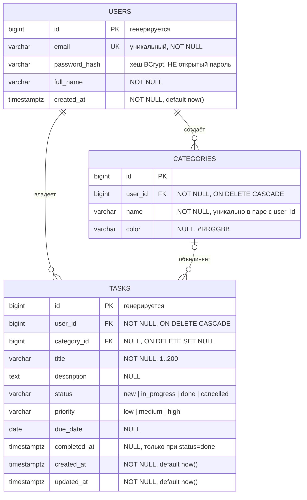

Сессия 1. База данных · 0–20 мин

# 1. Разбор предметной области (0–5 мин)

Из [`ЗАДАНИЕ.md`](../ЗАДАНИЕ.md) и [`db/README.md`](../db/README.md):

> Обязательны **две** сущности — **пользователь** и **задача**. Третья
> (**категория**) необязательна: за неё баллы не начисляются.

Ключевой вопрос проектирования: **кто владеет задачей**. Ответ — пользователь,
поэтому у задачи есть `user_id`, а у каждой выборки из `tasks` обязательно есть
фильтр по текущему пользователю. Отсюда же изоляция данных на всех уровнях:
в SQL, в API и в клиентах.

# 2. Сущности и атрибуты (5–12 мин)

## users

| Атрибут | Тип | Ограничения |
|---|---|---|
| `id` | `BIGSERIAL` | PK |
| `email` | `VARCHAR(255)` | `NOT NULL`, `UNIQUE`, формат email |
| `password_hash` | `VARCHAR(255)` | `NOT NULL` — **только хеш** |
| `full_name` | `VARCHAR(255)` | `NOT NULL` |
| `created_at` | `TIMESTAMPTZ` | `NOT NULL DEFAULT NOW()` |

## tasks

| Атрибут | Тип | Ограничения |
|---|---|---|
| `id` | `BIGSERIAL` | PK |
| `user_id` | `BIGINT` | `NOT NULL`, FK → `users(id) ON DELETE CASCADE` |
| `category_id` | `BIGINT` | NULL, FK → `categories(id) ON DELETE SET NULL` |
| `title` | `VARCHAR(200)` | `NOT NULL`, не пустой после обрезки пробелов |
| `description` | `TEXT` | NULL |
| `status` | `VARCHAR(16)` | `NOT NULL DEFAULT 'new'`, `CHECK` по списку |
| `priority` | `VARCHAR(16)` | `NOT NULL DEFAULT 'medium'`, `CHECK` по списку |
| `due_date` | `DATE` | NULL |
| `completed_at` | `TIMESTAMPTZ` | NULL, согласован со `status` |
| `created_at` | `TIMESTAMPTZ` | `NOT NULL DEFAULT NOW()` |
| `updated_at` | `TIMESTAMPTZ` | `NOT NULL DEFAULT NOW()` |

## categories (необязательная)

| Атрибут | Тип | Ограничения |
|---|---|---|
| `id` | `BIGSERIAL` | PK |
| `user_id` | `BIGINT` | `NOT NULL`, FK → `users(id) ON DELETE CASCADE` |
| `name` | `VARCHAR(100)` | `NOT NULL` |
| `color` | `VARCHAR(7)` | NULL, формат `#RRGGBB` |

> **Замечание:** `categories` привязана к пользователю, а не глобальная.
> Иначе один человек увидит категории другого. Уникальность — по паре
> `(user_id, name)`, а не по одному `name`.

# 3. Нормализация (12–16 мин)

На этом примере видно, зачем нужны формы:

| Форма | Требование | Как выполнено |
|---|---|---|
| **1НФ** | в ячейке одно атомарное значение | приоритет и статус — **отдельные колонки с `CHECK`**, а не строка `«высокий, срочно»» |
| **2НФ** | нет частичной зависимости от части ключа | нет составных PK, у которых атрибут зависел бы только от части ключа |
| **3НФ** | нет транзитивной зависимости | «склонность к продажам», «цвет категории» и прочие вычисляемые вещи **не хранятся** — они выводятся или считаются |

Соблазн «запихнуть всё в одну таблицу `tasks`» — типичная ошибка. На этапах
чемпионата за 1НФ–3НФ стоят отдельные баллы в разделе «Разработка базы данных».

# 4. ER-диаграмма (16–20 мин)

Создайте `db/erd/erd.md`:

````markdown
# ER-диаграмма — планировщик личных задач



## Правила целостности, зафиксированные в ER-модели

| Связь | Тип | Что означает |
|---|---|---|
| `users.id → tasks.user_id` | 1 : N | удалили пользователя — удалились его задачи |
| `users.id → categories.user_id` | 1 : N | категории принадлежат пользователю |
| `categories.id → tasks.category_id` | 1 : N | удалили категорию — задачи остались, `category_id` стал NULL |

## Нормализация

- **1НФ** — все атрибуты атомарны, списки значений вынесены в `CHECK`.
- **2НФ** — нет составных первичных ключей, частичных зависимостей нет.
- **3НФ** — производные и вычисляемые данные (сводка, дни до срока, счётчик
  задач) не хранятся, а считаются запросом.
````

> **Замечание:** `mermaid` рендерится прямо на GitHub — и в README, и в wiki.
> Этого достаточно для сдачи. Если эксперт просит исходник, приложите
> `db/erd/erd.drawio`: в draw.io вставьте текст диаграммы через
> `Arrange → Insert → Advanced → Mermaid`, либо нарисуйте вручную — схема
> простая.

# Проверка

Откройте `db/erd/erd.md` на GitHub — диаграмма должна отрисоваться. Убедитесь,
что на ней три сущности и шесть подписей к колонкам (`PK`, `FK`, `UK`).

# Коммит

```bash
git add db/erd/erd.md
git commit -m "База данных: ER-диаграмма и разбор предметной области"
```

# Если что-то не получилось

| Симптом | Что делать |
|---|---|
| Mermaid не отрисовался | проверить кавычки в подписях: только двойные `"..."`, одинарные ломают парсер |
| Непонятно, где ставить `CHECK` | см. [03-Скрипт-schema-sql](03-Скрипт-schema-sql), там разбор каждого ограничения |
| Сомневаетесь, нужна ли `categories` | она необязательна, баллов не даёт. Сделайте позже, если останется время |

---

Дальше: [03-Скрипт-schema-sql](03-Скрипт-schema-sql)
