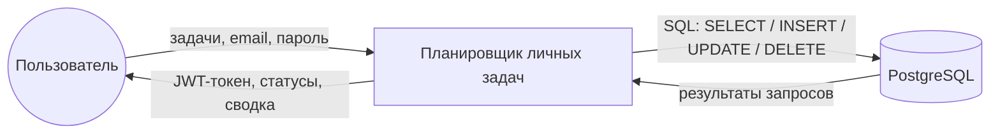

Сессия 9. UML-диаграммы · 120–140 мин

# Что делаем на этой странице

Четыре диаграммы, которые закрывают проектирование: варианты использования,
деятельность, функциональная модель IDEF0 и классы API. Все — на Mermaid:
GitHub рисует их прямо в `.md`, исходник остаётся текстом и правится как код.

Файлы живят в `docs/uml/` и ссылаются друг на друга из README.

# Шаг 1. Варианты использования

`docs/uml/use-case.md`:

````markdown
# Диаграмма вариантов использования — планировщик личных задач

```mermaid
usecaseDiagram
    actor Пользователь as U

    rectangle "Аутентификация" {
        UC01("Регистрация")
        UC02("Вход в систему")
    }

    rectangle "Задачи" {
        UC03("Просмотр списка задач")
        UC04("Фильтрация и поиск")
        UC05("Создание задачи")
        UC06("Редактирование задачи")
        UC07("Отметка выполнения")
        UC08("Удаление задачи")
        UC09("Просмотр сводки")
    }

    U --> UC01
    U --> UC02
    U --> UC03
    U --> UC04
    U --> UC05
    U --> UC06
    U --> UC07
    U --> UC08
    U --> UC09
```
````

Один актёр и девять вариантов использования. Отдельно стоит проверить, что
нет варианта «посмотреть чужую задачу» — такого требования в задании нет, и
его отсутствие на диаграмме совпадает с изоляцией данных из
[08-Изоляция-данных](08-Изоляция-данных).

![[images/uml26-s1-use-case.png]]
*use-case.md: актёр и две группы вариантов использования — аутентификация и задачи*

# Шаг 2. Диаграмма деятельности

`docs/uml/activity.md` — путь одной операции, а не экранов:

````markdown
```mermaid
flowchart TD
    A([Пользователь нажимает «Отметить выполненной»]) --> B{Токен есть?}
    B -- нет --> C[Показать форму входа]
    B -- да --> D[PATCH /api/tasks/{id}/complete]
    D --> E{Статус ответа}
    E -- 200 --> F[Обновить строку и сводку]
    E -- 401 --> C
    E -- 404 --> G[Сообщение «Задача не найдена»]
    F --> H([Готово])
    G --> H
    C --> H
```
````

Каждое решение на схеме — это реальная проверка в коде. Если ветки «нет
токена» или «404» на диаграмме нет, значит её нет и в обработчике, и
пользователь увидит пустой экран вместо ошибки.

![[images/uml26-s2-activity.png]]
*activity.md: одна операция от клика до результата с ветками 401 и 404*

# Шаг 3. Функциональная модель IDEF0

`docs/uml/idef0.md`. IDEF0 отвечает на вопрос не «как выглядит экран», а
«что система делает, чем управляется и на чём выполняется»:

````markdown

````

Управление (сверху) — правила предметной области: ограничения целостности,
схема авторизации, контракт API. Механизм (снизу) — PostgreSQL, ASP.NET Core,
клиенты.

![[images/uml26-s3-idef0.png]]
*idef0.md: контекстная диаграмма A0 — входы, выходы и хранилище*

Дальше A0 декомпозируется на три блока: приём и валидация → авторизация и
владение → хранение и запросы. Разделение по вопросам «правильно ли?», «кто
спрашивает?», «что и как хранится?» позволяет менять способ хранения, не
трогая валидацию.

# Шаг 4. Классы API

Диаграмма классов рисуется скриптом `tools/make-diagrams.py` в
`diagrams/uml.drawio`: контракты (`Envelope<T>`, `ApiError`), модели
(`TaskItem`, `UserDto`) и сервисы, которые работают с ними.

![[images/uml-classes-drawio.png]]
*uml.drawio: контракты, модели и сервисы API в одном полотне*

![[images/uml-classes-diagram.png]]
*Готовая диаграмма классов: от `Envelope<T>` до репозитория задач*

# Проверка

```bash
# все диаграммы в одном месте
ls docs/uml/
grep -l 'mermaid' docs/uml/*.md
```

Откройте каждый файл на GitHub: диаграмма должна отрисоваться без ошибок.
Проверьте, что в `use-case.md` есть все операции CRUD, в `activity.md` —
ветки ошибок, а в `idef0.md` — входы, выходы, управление и механизм.

# Коммит

```bash
git add docs/uml diagrams/uml.drawio
git commit -m "Проектирование: use-case, activity, IDEF0 и диаграмма классов"
```

# Если что-то не получилось

| Симптом | Что делать |
|---|---|
| Диаграмма не отрисовалась | проверьте, что блок открыт и закрыт тройными обратными кавычками |
| `flowchart` не понимает подпись на стрелке | кавычки в подписи обязательны: `--> "текст"` |
| Русские подписи съехали | сохраняйте файл в UTF-8 без BOM |
| Диаграмма классов не совпадает с кодом | источник истины — код в `api/TaskPlanner.Api`; перерисуйте после изменений |
| На диаграмме не видно границ транзакции | IDEF0 требует показать механизм; добавьте его подписью снизу |