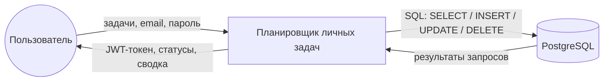
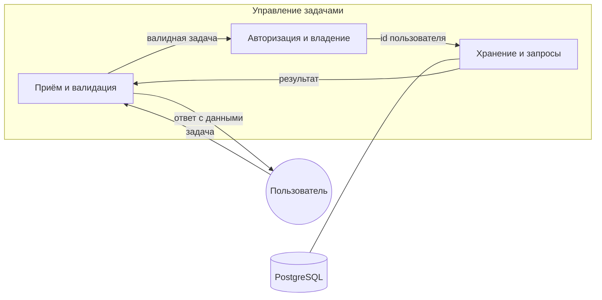

Сессия 9. UML-диаграммы · 120–140 мин

На региональном этапе 2026 «Проектирование программных решений» весит 18 % —
больше любой другой части. Диаграммы обязательны: варианты использования,
деятельности, IDEF0 и wireframe. На отборе их достаточно трёх, сделанных
качественно.

Все диаграммы — на **Mermaid**: GitHub рендерит их прямо в `.md`, исходник
остаётся в репозитории и правится как текст.

# 1. Диаграмма вариантов использования (120–128 мин)

Создайте `docs/uml/use-case.md`:

````markdown
# Диаграмма вариантов использования — планировщик личных задач

```mermaid
usecaseDiagram
    actor Пользователь as U
    actor "Система (планировщик)" as S

    rectangle "Аутентификация" {
        UC01("Регистрация")
        UC02("Вход в систему")
    }

    rectangle "Задачи" {
        UC03("Просмотр списка задач")
        UC04("Фильтрация и поиск")
        UC05("Создание задачи")
        UC06("Редактирование задачи")
        UC07("Отметка выполнения")
        UC08("Удаление задачи")
        UC09("Просмотр сводки")
    }

    U --> UC01
    U --> UC02
    U --> UC03
    U --> UC04
    U --> UC05
    U --> UC06
    U --> UC07
    U --> UC08
    U --> UC09

    UC03 ..> UC04 : <<include>>
    UC06 ..> UC05 : <<include>>
    UC07 ..> UC03 : <<extend>>

    UC01 ..> UC02 : <<extend>>
````

## Актёры

| Актёр | Описание |
|---|---|
| Пользователь | владелец задач, работает через web, desktop или mobile |

Отдельного актёра «Администратор» нет: в отборочном задании ролей не
предусмотрено. На региональном и финальном этапах актёров больше —
франчайзер, аппаратчик, инженер.

## Варианты использования

| ID | Название | Описание |
|---|---|---|
| UC01 | Регистрация | Пользователь создаёт аккаунт по email и паролю |
| UC02 | Вход в систему | Пользователь получает JWT-токен |
| UC03 | Просмотр списка задач | Пользователь видит только свои задачи, постранично |
| UC04 | Фильтрация и поиск | Сужает список по статусу, приоритету и тексту |
| UC05 | Создание задачи | Ввод названия, описания, приоритета, срока |
| UC06 | Редактирование задачи | Изменение полей существующей задачи |
| UC07 | Отметка выполнения | Переключение между «выполнена» и «в работе» |
| UC08 | Удаление задачи | Удаление с подтверждением |
| UC09 | Просмотр сводки | Всего, выполнено, не выполнено, просрочено |

## Отношения

- `UC03 ..> UC04 : <<include>>` — фильтрация всегда часть просмотра списка:
  без неё список всё равно показывается.
- `UC06 ..> UC05 : <<include>>` — редактирование использует ту же форму и те же
  правила валидации, что и создание.
- `UC07 ..> UC03 : <<extend>>` — отметка выполнения **дополняет** просмотр
  списка: имеет смысл только находясь в нём.
- `UC01 ..> UC02 : <<extend>>` — регистрация может сразу перейти во вход.
````

> **Замечание:** `<<include>>` — обязательная часть, `<<extend>>` —
> необязательное расширение в конкретной точке. Путать их — самая частая
> ошибка: если вариант использования работает и без другого, это `extend`.

# 2. Диаграмма деятельности (128–134 мин)

Создайте `docs/uml/activity.md`:

````markdown
# Диаграмма деятельности — создание и выполнение задачи

```mermaid
stateDiagram-v2
    [*] --> Начало

    Начало --> Авторизован: токен действителен
    Начало --> Вход: нет токена или 401

    Вход --> ПроверкаПароля
    ПроверкаПароля --> Авторизован: пароль верный
    ПроверкаПароля --> [*]: пароль неверен

    state "Работа с задачей" as Работа {
        direction TB

        [*] --> ВыборДействия
        ВыборДействия --> ВводПолей: создание или редактирование
        ВводПолей --> ПроверкаПолей

        ПроверкаПолей --> ВводПолей: есть ошибки (вернуться)
        ПроверкаПолей --> Сохранение: поля корректны

        Сохранение --> ОшибкаБД: нарушение ограничения
        Сохранение --> [*]: 201 / 200

        ОшибкаБД --> [*]: 400 с понятным сообщением

        ВыборДействия --> ПереключитьСтатус: отметка выполнения
        ПереключитьСтатус --> ОбновитьСписок
        ОбновитьСписок --> [*]
    }

    Авторизован --> Работа
    Работа --> [*]
```

## Поток информации

| Шаг | Данные |
|---|---|
| Авторизация | email, пароль → JWT-токен |
| Создание задачи | название, описание, приоритет, срок, статус → объект задачи |
| Валидация | ошибки полей → 400 `VALIDATION_ERROR` |
| Сохранение | id, `createdAt`, `updatedAt`, `completedAt` |
| Отметка выполнения | `status`, `completedAt` |
| Сводка | `total`, `done`, `notDone`, `overdue`, `byPriority` |
````

# 3. Модель IDEF0 (134–140 мин)

Создайте `docs/uml/idef0.md`:

````markdown
# Функциональная модель IDEF0 — планировщик личных задач

## Контекстная диаграмма (A0)



**Управляющее воздействие (сверху):** правила предметной области —
ограничения целостности (`NOT NULL`, `CHECK`, внешние ключи), схема авторизации
(JWT, хеширование пароля), контракт API.

**Механизм (снизу):** PostgreSQL 15, ASP.NET Core, клиенты (web, Avalonia,
React Native).

## Декомпозиция первого уровня (A0 → A1)



| Блок | Функция | Входы | Выходы | Управление | Механизм |
|---|---|---|---|---|---|
| P1 | Приём и валидация данных | JSON запроса | валидная модель или 400 | правила валидации | FluentValidation |
| P2 | Авторизация и проверка владения | токен, id задачи | id пользователя или 401/404 | JWT, изоляция данных | JwtBearer, `ICurrentUser` |
| P3 | Хранение и запросы | id пользователя, предикат | строки, счётчики | ограничения БД | EF Core, Npgsql |

## Почему декомпозиция именно такая

Разделение по трём вопросам, а не по экранам:

- **P1 «правильно ли?»** — не зависит от того, кто спрашивает.
- **P2 «кто спрашивает?»** — не зависит от валидности данных.
- **P3 «что и как хранится?»** — не зависит ни от валидации, ни от роли.

Такое разделение позволяет менять, например, способ хранения, не трогая
валидацию.
````

# Проверка

1. Все диаграммы отрисовались на GitHub без ошибок — откройте файлы в
   репозитории.
2. В `use-case.md` есть актёр, 9 вариантов использования, отношения
   `include` и `extend`.
3. В `activity.md` есть начало, ветвления, слияния и конечное состояние.
4. В `idef0.md` есть контекстная диаграмма и декомпозиция первого уровня,
   в таблице указаны входы, выходы, управление и механизмы.

```bash
# все диаграммы в одном месте
ls docs/uml/
```

# Коммит

```bash
git add docs/uml
git commit -m "Документирование: UML-диаграммы (use case, activity, IDEF0)"
```

# Если что-то не получилось

| Симптом | Что делать |
|---|---|
| Mermaid не отрисовался | проверьте синтаксис: в `stateDiagram-v2` подписи в `state "..." as Имя` без кавычек внутри; в `usecaseDiagram` идентификаторы латиницей |
| «Слишком длинная диаграмма» | разбейте на несколько файлов или сократите подписи |
| Непонятно, `include` или `extend` | спросите себя: работает ли вариант **без** второго? Нет — `include`. Да — `extend` |
| IDEF0 не рисуется в mermaid | стрелки IDEF0 (входы слева, выходы справа, управление сверху, механизм снизу) передаются расположением блоков и подписями на рёбрах |

## Иллюстрации

![[images/uml-classes-drawio.png]]
*UML-диаграмма классов в draw.io*

![[images/uml-classes-diagram.png]]
*Сущности, контекст, конверт ответа и точки входа API*
